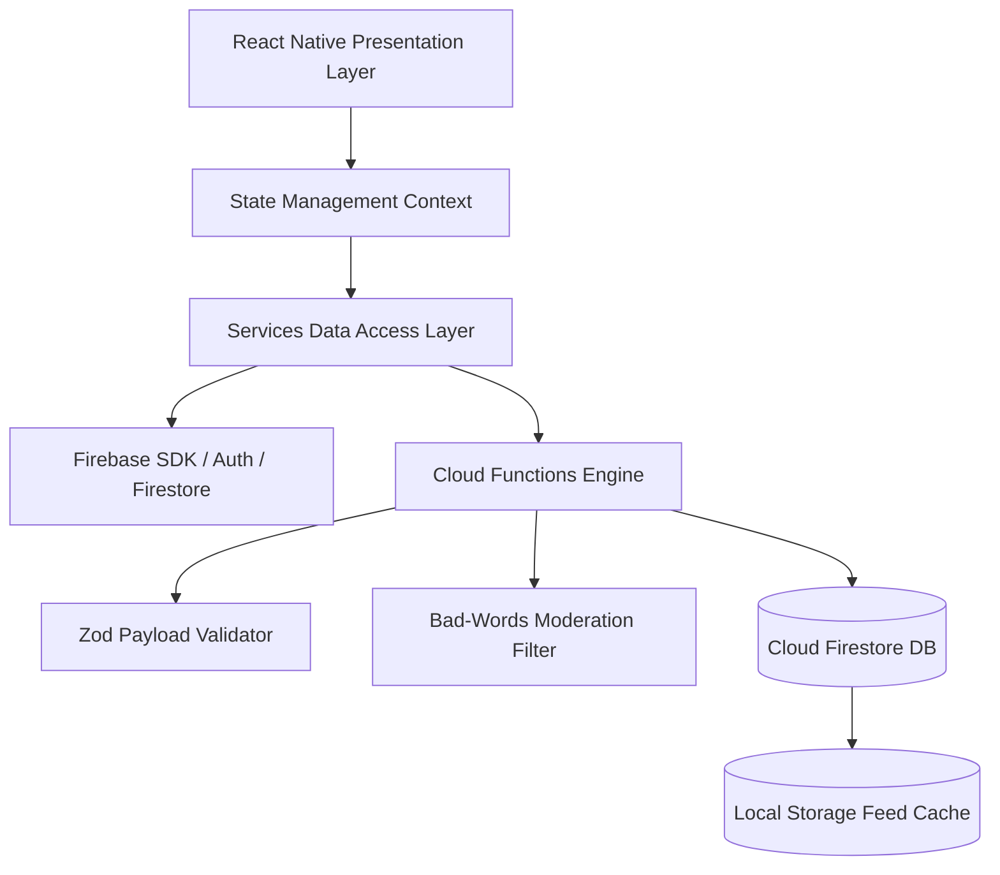

# System Architecture Guide

The **Mansoo** mobile application is engineered on React Native (Expo SDK 51) using clean layered architecture.

---

## 🏛️ High-Level System Architecture

---

## 🔑 Key Architecture Layers

1. **Presentation Layer (`src/screens/` & `src/components/`)**:
   - Built with pure React Native components and Expo SDK primitives.
   - Atomic design components residing in `src/components/ui/`.
2. **State & Context Layer (`src/context/`)**:
   - `AuthContext`: Authentication session lifecycle.
   - `ThemeContext`: Dynamic theme tokens & dark mode switching.
   - `LanguageContext`: i18n locale and RTL configuration.
3. **Data Access Layer (`src/services/`)**:
   - Decouples UI components from Firebase SDK logic.
   - Provides optimistic UI state updates and offline fallbacks.

---

## Related Guides
- [Folder Structure](folder-structure.md)
- [Design System](design-system.md)
- [State Management](state-management.md)
