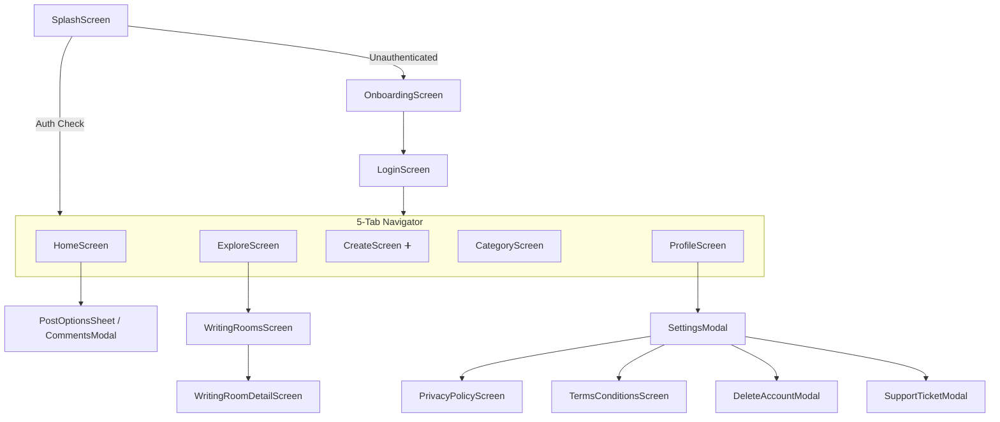

# Navigation System Guide

Mansoo utilizes React Navigation (`@react-navigation/native-stack` and `@react-navigation/bottom-tabs`).

---

## 🧭 Navigation Hierarchy Diagram

---

## Related Guides
- [System Architecture](architecture.md)
- [State Management](state-management.md)
