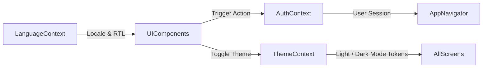

# State Management Architecture Guide

Mansoo uses lightweight, efficient React Context API modules.

---

## 🔄 State Flow Diagram

---

## 📦 Context Modules

1. **`AuthContext` (`src/context/AuthContext.js`)**:
   - Listens to Firebase `onAuthStateChanged`.
   - Supplies `user`, `isAuthenticated`, `isEmailVerified`, `login`, `signUp`, `logout`, `deleteAccount`.
2. **`ThemeContext` (`src/theme/ThemeContext.js`)**:
   - Supplies `theme`, `colors`, `spacing`, `radius`, `typography`, `shadows`, `isDarkMode`, `toggleTheme`.
3. **`LanguageContext` (`src/context/LanguageContext.js`)**:
   - Dynamic locale switching across English, Hindi, Hinglish, Urdu (RTL), and Russian.

---

## Related Guides
- [System Architecture](architecture.md)
- [Design System](design-system.md)
