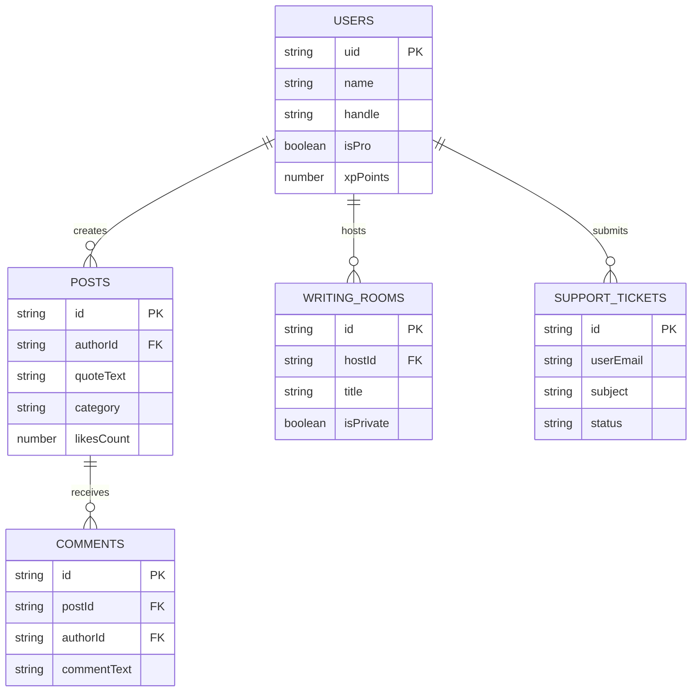

# Firestore Database Model & Schema

Mansoo Firestore database is organized into collections optimized for read efficiency and low lock contention.

---

## 🗄️ Entity-Relationship Diagram

---

## Related Guides
- [Backend Overview](backend.md)
- [Database Indexing](indexes.md)
