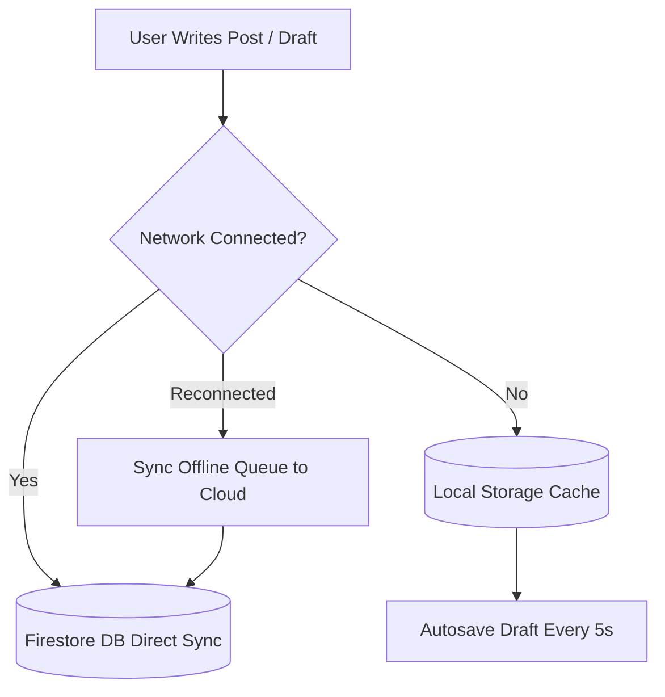

# Offline Support & Caching Architecture

Mansoo supports offline reading, local draft autosave, and optimistic UI updates.

---

## 📶 Offline Data & Sync Flow

---

## Related Guides
- [System Architecture](../architecture/architecture.md)
- [UI Components](components.md)
