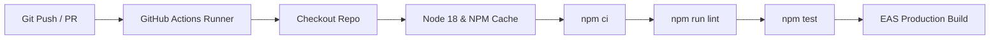

# CI/CD Pipeline Guide

Automated CI/CD workflow defined in `.github/workflows/ci.yml`.

---

## ⚙️ CI/CD Workflow Pipeline Diagram

---

## Related Guides
- [Deployment Guide](deployment.md)
- [Monitoring & Observability](monitoring.md)
