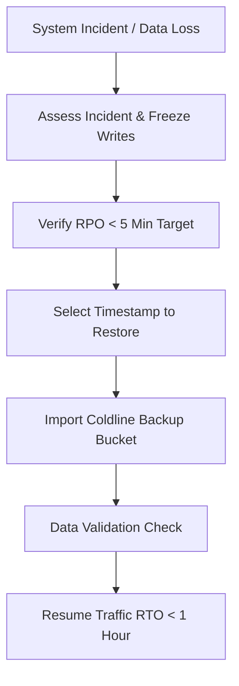

# Disaster Recovery & PITR Runbook

Enterprise disaster recovery procedures for **Mansoo**.

---

## 🛟 Point-In-Time Recovery Flow

---

## Service Objectives
- **RTO (Recovery Time Objective)**: `< 1 Hour`
- **RPO (Recovery Point Objective)**: `< 5 Minutes`

---

## Related Guides
- [Backup Strategy](backup.md)
- [Database Migration](migration.md)
