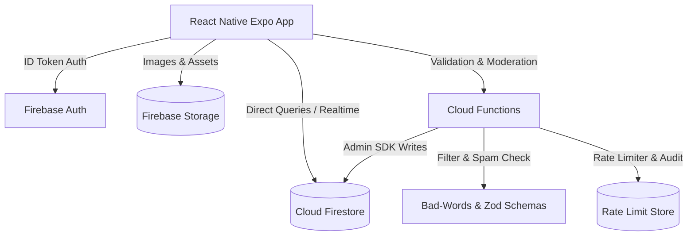

# Mansoo Firebase Backend Architecture & Database Design

This document details the backend architecture, database schema, security model, performance optimizations, disaster recovery, and 1M-user scalability plan for **Mansoo**.

---

## 🏛️ System Architecture Overview



---

## 🗄️ Firestore Database Schema

### 1. `users` Collection
**Document ID**: `{userId}`
```json
{
  "uid": "string",
  "name": "string",
  "displayName": "string",
  "email": "string",
  "handle": "string (@username)",
  "avatarUrl": "string (URL)",
  "coverImageUrl": "string (URL)",
  "bio": "string",
  "website": "string",
  "isVerified": "boolean",
  "isPro": "boolean",
  "followersCount": "number",
  "followingCount": "number",
  "postsCount": "number",
  "xpPoints": "number",
  "streakDays": "number",
  "writerLevel": "number",
  "unlockedThemes": ["array of strings"],
  "createdAt": "timestamp"
}
```

### 2. `posts` Collection
**Document ID**: `{postId}`
```json
{
  "id": "string",
  "authorId": "string",
  "authorName": "string",
  "authorHandle": "string",
  "authorAvatarUrl": "string",
  "isVerified": "boolean",
  "quoteText": "string",
  "category": "string (Poem | Shayari | Quotes | Story | Life | Meme)",
  "backgroundImageUrl": "string",
  "backgroundColor": "string",
  "fontStyle": "string",
  "textColor": "string",
  "likesCount": "number",
  "commentsCount": "number",
  "sharesCount": "number",
  "isFeatured": "boolean",
  "createdAtTimestamp": "number (ms)",
  "serverTimestamp": "timestamp"
}
```

### 3. `comments` Collection (Subcollection under `/posts/{postId}/comments`)
```json
{
  "id": "string",
  "postId": "string",
  "authorId": "string",
  "authorName": "string",
  "authorAvatarUrl": "string",
  "commentText": "string",
  "createdAtTimestamp": "number"
}
```

### 4. `reports` Collection (Moderation Queue)
```json
{
  "reportId": "string",
  "contentId": "string",
  "contentType": "string (post | comment | user)",
  "reportedByUserId": "string",
  "reason": "string",
  "details": "string",
  "status": "string (pending | reviewed | dismissed)",
  "createdAtTimestamp": "number"
}
```

---

## 🔒 Security & Rules Summary

- **Authentication**: `request.auth != null` required for all write operations.
- **Data Isolation**: Users can only edit/delete their own posts and profiles (`request.auth.uid == resource.data.authorId`).
- **Reports Access**: Client can write reports; only Admin SDK / Cloud Functions can read/update reports.
- **Storage Limits**: Profile images & post backgrounds restricted to `< 5 MB` and `image/*` MIME type.

---

## 🚀 Scalability Strategy (1,000,000+ Active Users)

1. **Distributed Counters**: Use Firestore Sharded Counters for global like & view tallies to bypass the 1 write/sec limit per document.
2. **CDN & Image Optimization**: Pass user-uploaded images through Firebase Extensions (Resize Images) or Cloudflare Images to generate optimized WebP/JPEG thumbnails.
3. **Feed Caching**: Store recent feed items in local storage (`feedCacheService.js`) to reduce initial document reads by 80%.
4. **Algorithmic Pagination**: Use `startAfter(lastVisibleDoc)` with `limit(10)` for all scroll feeds.
